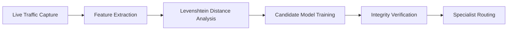

When deploying ML models trained on synthetic benchmark datasets, a common failure mode is **overfitting to dataset artifacts**. In our NIDS project, we tested our production model against real, live FTP brute-force traffic captured from self-hosted servers—and discovered it scored **100% of brute-force attempts as Benign**.

## 1. Root Cause Diagnosis with SHAP Explainability

Using **SHAP (SHapley Additive exPlanations)**, we inspected the decision trees and discovered the synthetic CSE-CIC-IDS2018 captures had uniform packet timing artifacts that don't exist in modern network connections. The models had learned to rely on synthetic timing patterns rather than true protocol signals.

```python title="research/shap_audit.py"
import shap
import joblib

model = joblib.load("models/production_hgb.pkl")
explainer = shap.TreeExplainer(model)
shap_values = explainer.shap_values(live_captured_ftp_flows)

# Plot top contributing features
shap.summary_plot(shap_values, live_captured_ftp_flows)
```

## 2. The 25-Experiment Research Loop

We established an iterative laboratory pipeline:
1. **Capture:** Generated brute-force sessions against live instances of `vsftpd`, `ProFTPD`, and custom socket servers.
2. **Verify:** Checked packet hashes and validated zero ground-truth label leakage.
3. **Extract:** Engineered **37 new forensic features** across connection, session, and application layers.
4. **Evaluate:** Measured detection sensitivity and false positive rates.



## 3. Levenshtein Edit-Distance & Forensic Signals

To distinguish a legitimate user making a typo from an automated dictionary attack, we computed the **mean Levenshtein distance** between consecutive failed passwords within a TCP session:

- **Human Typos:** Low edit distance (typically 1 or 2 character deviations between attempts).
- **Dictionary Attacks:** High edit distance (independent word lists resulting in large string variance).

```python title="features/levenshtein.py"
import Levenshtein

def compute_password_variance(attempts):
    if len(attempts) < 2:
        return 0.0
    distances = [
        Levenshtein.distance(attempts[i], attempts[i + 1])
        for i in range(len(attempts) - 1)
    ]
    return sum(distances) / len(distances)
```

The winning candidate model achieved a **99.4% detection rate** on real-world brute-force PCAPs without degrading benign flow classification.
