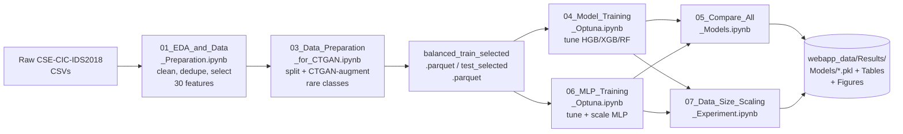
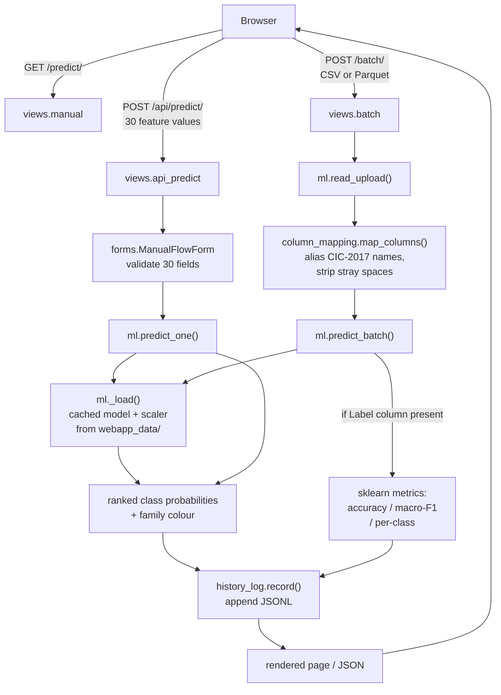
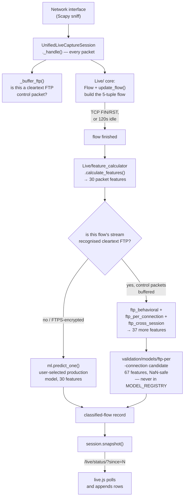
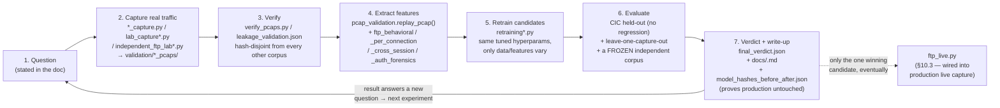

# IDS Repository Documentation

**Repo:** [mohitbhatta2-ship-it/IDS](https://github.com/mohitbhatta2-ship-it/IDS) · **Size:** ~237 MB, 1,787 tracked files · Generated by reading the actual source (not just the README)

## Scope note

This repo has 1,787 files, but roughly 1,600 of them are *generated data* — PCAP captures, per-flow metadata JSON, CSV metric tables, and `.pkl` model files — produced in large, near-identical batches by a handful of scripts (e.g. one "collect_*" script can write 30+ PCAP + JSON pairs). Describing each one individually would just repeat the same sentence hundreds of times, so:

- Every **source file** (Python, notebooks, HTML/CSS/JS, config, docs) gets its own row below — that's ~185 files.
- Every **generated-data directory** is described **once**, as a pattern (what's in it, how many files, how they're named), with the script that produced it.

---

## 1. What this repo actually is

It's two projects sharing one repository:

1. **A production network intrusion detector.** A Django web app (`webapp_django/`) serves three trained models (HistGradientBoosting, XGBoost, MLP) that classify network flows into 15 classes (Benign + 14 attack types) from 30 CICFlowMeter-style features, trained on the CSE-CIC-IDS2018 dataset via six Jupyter notebooks (`C_notebooks/`). It's deployed at nids-ids2018.onrender.com.
2. **An FTP brute-force detection research program.** The 30-feature production model turns out to be unable to detect *real* FTP brute-force traffic (it was trained on the CIC dataset's synthetic captures and doesn't generalize) — `validation/`, `docs/`, and roughly 60 of the 124 Python files under `webapp_django/predictor/` are a long, iterative, well-documented experiment log chasing a fix for this, one PCAP-capture-and-retrain cycle at a time. The docs read like a research diary: each `docs/*.md` file states a hypothesis, what was built, and the result (including negative results).

**A discrepancy worth flagging up front:** the root `README.md`'s "Known limitations" says live capture is "CLI-only; not yet wired into the Django web UI." That's stale — `webapp_django/predictor/apps.py` and `predictor/urls.py` show a live-capture page **is** wired in (`/live/`), and `predictor/ftp_live.py` transparently routes cleartext FTP traffic on that page to the validated FTP research model. `CHANGES.md` also only documents the first few PRs; the entire FTP research arc (25 `docs/` files, ~60 Python modules, ~150 MB of `validation/`) isn't mentioned there at all — it happened after that changelog was last written.

---

## 2. Root directory

| File | Description |
|---|---|
| `README.md` | Main project readme — results tables, web app tour, quick start, notebook order, live-capture status, known limitations, and an "AI assistance" disclosure section (12 of 40 commits carry a `Co-Authored-By: Claude` trailer). |
| `CHANGES.md` | Change log for the *early* PRs only (the data-scaling notebook, the Django web app, and the `Live/` bug-fix pass). Doesn't cover the FTP research arc — that story lives in `docs/` instead. |
| `app.py` | A broken 45-line Flask stub — five routes (`/`, `/live`, `/offline`, `/dataset`, `/models`) that each call `render_template()` for a template file that doesn't exist, so every route 500s. It's a leftover from before the repo switched to a 923-line Streamlit dashboard, which was itself later replaced by the Django app. Not used; `webapp_django/` is the real app. |
| `ftp_attack_test.py` | An 8-line-of-logic manual test script: opens an FTP connection to `127.0.0.1:2121` and tries 8 hardcoded common passwords for user `alice`, printing success/failure per attempt. A quick way to generate a brute-force pattern against a locally running FTP server. |
| `requirements.txt` | Python deps for the notebooks and the `Live/` module (pandas, numpy, scikit-learn, xgboost, joblib, matplotlib, plotly, pyarrow, optuna, scapy, shap, pytest). The web app has its own separate pinned list. |
| `render.yaml` | Render.com "Blueprint" deploy spec: web service rooted at `webapp_django/`, built by `build.sh`, started with `gunicorn ids_web.wsgi:application`, auto-generates `IDS_SECRET_KEY`, pins `PYTHON_VERSION=3.12.7` (must match the scikit-learn/xgboost versions the models were pickled with). |
| `.gitattributes` | Git LFS config: `*.pkl` and `*.parquet` are LFS-tracked by default, with explicit exceptions listed for ~10 experimental candidate-model directories under `validation/models/` (LFS push wasn't available in that environment, so those are stored as plain blobs instead). |
| `.gitignore` | Excludes raw/intermediate notebook data, CTGAN synthetic-data folders, `*.pkl` model files (re-included specifically for `webapp_data/`), the Django `db.sqlite3` and `logs/`, and the live-capture output CSV. |
| `.devcontainer/devcontainer.json` | GitHub Codespaces config — still targets the old Streamlit app (`postAttachCommand` runs `streamlit run app.py`), so it doesn't reflect the current Django app either. |
| `.github/workflows/deploy.yml` | GitHub Action that calls Render's deploy hook on every push to `main` that touches `webapp_django/**`, the model/data folders, or itself — because Render's Blueprint-managed services don't auto-deploy on push otherwise. |

---

## 3. `C_notebooks/` — the training pipeline (run in order)

| File | Description |
|---|---|
| `01_EDA_and_Data_Preparation.ipynb` | Loads the raw CSE-CIC-IDS2018 CSVs, verifies schema consistency across files, audits data quality, cleans each raw file in chunks to Parquet, merges/deduplicates with DuckDB, runs EDA, and builds the final stratified `ml_dataset.parquet` (30 selected features + Label). |
| `03_Data_Preparation_for_CTGAN .ipynb` | Loads the EDA output, encodes labels, splits train/test, selects the 30 features by mutual information, downsamples the Benign majority class, trains a CTGAN model per rare attack class to generate synthetic minority-class rows, sanity-checks real-vs-synthetic distributions, and merges everything into the final balanced training parquet. |
| `04_Model_Training_Optuna.ipynb` | Defines a unified Optuna search space, tunes HistGradientBoosting, XGBoost, and RandomForest, ranks them, and retrains the top 3 on the full training set — this is where `*_best_params.json` and the production `.pkl` files are written. |
| `06_MLP_Training_Optuna.ipynb` | Same idea as 04, but for the MLP: scales features first (`MLP_StandardScaler.pkl`), runs its own Optuna search over architecture + training hyperparameters, then retrains the best MLP on the full set. |
| `05_Compare_All_Models (1).ipynb` | Builds the side-by-side comparison table (`model_comparison.csv`) across all four tuned models: accuracy/macro-F1/train time, a grouped precision/recall/F1 chart, train-vs-test overfitting check, rare-class performance, class-distribution-before/after-CTGAN, and top mutual-information features. |
| `07_Data_Size_Scaling_Experiment.ipynb` | The "how much data is enough?" experiment (see README) — retrains all four models at 3 fixed-hyperparameter data sizes (25k/100k/281k rows) against one frozen test set, isolating the effect of data volume from tuning. Also independently reproduces notebooks 04/06's headline numbers as a pipeline-fidelity check. Portable across machines via `NIDS_PROJECT_PATH`, unlike 04/06 which hardcode a Windows path. |
| `mlp_optuna_study.db` | SQLite database Optuna writes its MLP trial history to (from notebook 06). |

---

## 4. `Live/` — experimental CLI packet-capture pipeline

A standalone command-line tool (separate from the Django app's own live-capture code, though the Django app reuses three of its modules — see §8.2). Captures real traffic with Scapy, assembles it into bidirectional flows, and reimplements 30 CICFlowMeter feature calculations by hand so live traffic can be scored by the same trained models.

| File | Description |
|---|---|
| `config.py` | Central config: locates the data bundle (`$NIDS_PROJECT_PATH` or by searching for `webapp_data/`/`c_filesnew/`), picks which model to load (`$NIDS_MODEL`, default HistGradientBoosting — the original code hardcoded the absent, weakest RandomForest model), sets `FLOW_TIMEOUT=120s` to match CICFlowMeter, and resolves the capture interface. |
| `flow.py` | The `Flow` dataclass — one live network flow's accumulated state: packet/byte counters, per-direction packet-length and arrival-time lists, TCP flag counts, header-length lists, and the initial forward TCP window. `start_time`/`last_seen` are filled from packet timestamps (not wall-clock — a past bug that broke duration when replaying stored captures). |
| `feature_extractor.py` | `update_flow(flow, pkt)` — folds one packet into a `Flow`: measures packet length as the **transport-layer payload** (not the full Ethernet frame, matching CICFlowMeter), the header length as the **TCP data-offset / 8 bytes for UDP** (not the IP header), captures the first forward TCP window, and counts SYN/ACK/FIN/RST/PSH/URG flags. |
| `feature_calculator.py` | `calculate_features(flow)` — turns an accumulated `Flow` into the 30-feature dict the models expect (duration, IAT stats, per-direction packet-length stats, header lengths, rates). `Fwd Seg Size Min` is read from header lengths (not payload — CICFlowMeter defines it as a header measure), and `Init Fwd Win Byts` defaults to `-1` (CICFlowMeter's "no forward window" sentinel), not `0`. |
| `flow_builder.py` | Module-level flow table (`flows = {}`) keyed by 5-tuple, with `get_or_create_flow()` matching forward or reverse direction and evicting the oldest flow once `MAX_FLOWS` is hit. **Not reused by the Django app** — it eagerly imports `config` and keeps state in a module global, which doesn't suit a multi-threaded server. |
| `flow_manager.py` | Expires idle/finished flows on the **capture clock** (not wall-clock — the old bug), classifies each one (`calculate_features` → `preprocess_live` → `predict`), prints a formatted verdict, and appends the row to the output CSV. Also not reused by Django, for the same reason as `flow_builder.py`. |
| `live_predictor.py` | Lazily loads the selected model/scaler/label-map (so merely importing the module doesn't cost several seconds or fail without Git LFS), and exposes `predict(df)` returning a ranked list of `(label, probability)` tuples. |
| `preprocess_live.py` | Turns a raw feature dict into a one-row DataFrame with exactly the training column order (filling any absent column with 0), using the pickled `FEATURE_ORDER` list. |
| `csv_writer.py` | `append_flow()` — appends one classified flow as a row to the output CSV, writing the header only if the file is new. |
| `list_interfaces.py` | 5-line script: prints every interface `scapy.get_if_list()` returns, numbered. |
| `show_interfaces.py` | 10-line script: prints full metadata (index, name, GUID, description, IP) for every interface in `scapy.IFACES`. |
| `sniff_test.py` | The CLI entry point. `Capture` class feeds packets into the flow table, sweeps expired flows every `CLEANUP_INTERVAL` seconds (not every packet — an earlier O(flows)-per-packet bug), and flushes all open flows at the end so a short capture isn't silently dropped. Supports `--iface`, `--pcap` (replay a file), `--count`, `--quiet`. |
| `test_prediction.py` | A 26-line command-line smoke test (not a pytest test, despite the name) — reads the first row of a captured CSV and prints its ranked predictions. Run directly with a CSV path argument. |
| `validate_live_features.py` | Feature-parity report: loads the Parquet training set, compares each of the 30 features' live-observed range against the training range, and flags any feature where more than 20% of live values fall outside it — because out-of-range input can silently produce meaningless predictions even though the code runs fine. Writes `Results/Tables/live_feature_parity.csv`. |
| `test_live_pipeline.py` | Pytest suite (338 lines) using synthetic Scapy packets — no network access or root needed. Covers the four defects that originally made the module unable to run at all, plus 7 regression tests for the CICFlowMeter feature-parity fixes (payload-vs-frame length, the `Seg Size Avg == Pkt Len Mean` identity, `Fwd Seg Size Min` as a header measure, `Init Fwd Win Byts` sentinel). 22 tests total. |

---

## 5. `sample_data/` — demo/test datasets for the web app's Dataset-upload page

| File | Description |
|---|---|
| `README.md` | Explains what each sample file demonstrates and why the mixed-sample scores (accuracy ~0.90, macro-F1 ~0.87) differ from the notebooks' headline numbers (rare classes are over-represented in a balanced sample). |
| `build_per_attack_datasets.py` | Generates one 500-row CSV per traffic class from the held-out test parquet (topping up from the training parquet only for the 6 classes with fewer than 500 held-out rows, and recording exactly how many of each in `MANIFEST.csv`). Deliberately never uses CTGAN synthetic rows, since scoring the model on data generated to help train it would be circular. |
| `verify_per_attack_datasets.py` | Runs every generated per-attack CSV through the actual `ml.predict_batch()` the web app uses, writes `VERIFICATION.csv`, and checks that each file's label-free twin in `no_labels/` produces byte-identical predictions (proof the `Label` column never leaks into the model input). |
| `test_sample_with_labels.csv` / `test_sample_no_labels.csv` | 3,561 rows sampled from the held-out test set, balanced across all 15 classes — with and without the ground-truth `Label` column. |
| `foreign_dataset_ids2017_style.csv` | The same 3,561 rows, renamed to CIC-IDS**2017** column-naming conventions (e.g. `Destination Port` instead of `Dst Port`) with stray leading spaces — a live demo of the column-mapping/alias layer (§8.2, `column_mapping.py`). |
| `per_attack/*.csv` (15 files) + `per_attack/no_labels/*_no_labels.csv` (15 files) | One labelled and one unlabelled CSV per traffic class, generated by `build_per_attack_datasets.py`. `per_attack/README.md` documents, per file, whether it actually predicts as its own class — 14 of 15 do; `infilteration.csv` famously does not (the model calls 63.8% of it Benign, which the README treats as an honest demonstration of a real model blind spot rather than hiding it). |
| `per_attack/MANIFEST.csv`, `per_attack/VERIFICATION.csv` | Machine-readable outputs of the two scripts above: row provenance (held-out vs. topped-up-from-training) and per-file prediction accuracy respectively. |

---

## 6. `webapp_data/` and `c_filesnew/` — the trained-model data bundle

Two near-duplicate data bundles (the README flags this duplication as a known, unresolved issue). `predictor/ml.py` and `Live/config.py` both search upward from their own location for whichever of the two exists and has `Results/Models/`, preferring `webapp_data/`. Neither directory contains original source code — they're pipeline *output*.

| Path (pattern) | Description |
|---|---|
| `webapp_data/Processed_Data/`, `c_filesnew/Processed_Data/` | `label_mapping.csv` (encoded ID ↔ class name), `selected_features.pkl` (the 30 ordered feature names), plus (in `webapp_data/` only — `.gitignore`'d elsewhere) the actual training/test Parquet files notebooks 01–07 read and write. |
| `webapp_data/Results/Models/` (LFS), `c_filesnew/` has no `.pkl`s | The 4 trained `.pkl` classifiers (HistGradientBoosting, XGBoost, MLP + its `StandardScaler`) plus each model's Optuna best-params JSON, classification report, confusion-matrix PNG, and metrics CSV. This is the directory `build.sh` checks for real (non-pointer) files before allowing a deploy. |
| `webapp_data/Results/Tables/`, `.../Figures/`, `c_filesnew/Reports/`, `c_filesnew/Results/` | Every CSV table and PNG chart the notebooks produce: model comparison, data-scaling results, Optuna trial histories, CTGAN before/after class distributions, correlation heatmaps, mutual-information rankings, per-attack CTGAN comparisons, data-quality-audit reports. |
| `webapp_data/CTGAN/Models/`, `.../Synthetic/` | The trained CTGAN generator (one `.pkl` per rare class) and its synthetic output rows (Parquet), from notebook 03. |
| `webapp_data/C_notebooks/` | A second copy of the notebooks plus `app.py` — appears to be an artifact of how the data bundle was assembled rather than an intentional second source location. |
| `webapp_data/requirements.txt` | Empty file. |

---

## 7. `docs/` — the FTP research log (25 files)

Every file here documents one experiment in the FTP brute-force detection research program (see §1). They follow a consistent format: a bolded "what's frozen / what this doesn't touch" safety statement, the question being asked, what was built, and the result — including several honest negative results. Read in the order below, they tell one continuous story; alphabetically (their actual folder order) they don't, so both are given.

**The story, in order:** the production model can't detect real FTP brute-force (`real-pcap-validation.md`) → SHAP shows it leans on CIC-specific artifacts (`shap-analysis.md`) → ruling out "maybe it's just our feature extractor" by cross-checking against an independent CICFlowMeter implementation (`cicflowmeter-extraction-experiment.md`) → first retraining attempts on real captures (`realistic-pcap-data-expansion.md`, `-diversification.md`, `realistic-pcap-retraining.md`, `-retraining-v2.md`) → first truly independent test corpus (`independent-real-pcap-test.md`) → diagnosing *why* the retrained candidate still has a high false-positive rate (`final-robustness-analysis.md`) → collecting traffic aimed at that specific weakness (`targeted-benign-pcap-collection.md`, `targeted-benign-retraining.md`, `balanced-real-retraining.md`) → a new idea: read the FTP *application-layer* (USER/PASS/response codes) instead of just packet timing (`ftp-behavioral-features.md`) → stress-testing that idea against messy real traffic (`ftp-behavioral-robustness.md`) → fixing what the stress test broke (`ftp-behavioral-robust-retraining.md`) → asking whether one specific feature is a shortcut (`ftp-failed-login-ablation.md`) → adding more behavioural nuance (`ftp-ext-behavioural-experiment.md`) → adding cross-session context (`ftp-cross-session-behavior.md`, `-independent-validation.md`) → adding per-connection context (`ftp-per-connection-detector.md`) → the hardest remaining case, typo vs. dictionary attack (`ftp-auth-forensics.md`) → one last, maximally-independent validation (`final-independent-ftp-validation.md`) → wiring the winning candidate into the live console (`ftp-live-detector.md`, `ftp-production-integration.md`) → plus one always-available read-only reporting layer (`attack-severity-dashboard.md`).

| File (alphabetical) | Description |
|---|---|
| `attack-severity-dashboard.md` | Read-only rollup of existing validation results by attack *family* and a hand-authored *severity* table — never retrains or calls the model. |
| `balanced-real-retraining.md` | Trains on a larger, class-balanced mix of real FTP + benign captures; evaluated on the frozen 36-PCAP independent set. |
| `cicflowmeter-extraction-experiment.md` | Re-extracts the same real PCAPs with an independent CICFlowMeter Python port, to separate "model doesn't generalize" from "our custom feature extractor doesn't match CICFlowMeter." |
| `final-independent-ftp-validation.md` | Evaluates every frozen candidate once on the most different test stack yet (vsftpd + lftp, non-loopback network namespace, FTPS). |
| `final-robustness-analysis.md` | Diagnoses (not fixes) why the best retrained candidate has a 28.2% benign false-positive rate on the independent test — where the FPs cluster, via SHAP and feature-distribution comparison. |
| `ftp-auth-forensics.md` | The hardest remaining case: a benign user who mistypes their password vs. an attacker who fails then succeeds. New features quantify *edit distance* between failed and successful passwords. |
| `ftp-behavioral-features.md` | Introduces reading the FTP control channel itself (login attempts, failure ratio, command variety) instead of only packet/timing statistics. |
| `ftp-behavioral-robust-retraining.md` | Retrains the behavioural model on deliberately messy real traffic so it stops using "any failed login = attack" as a shortcut. |
| `ftp-behavioral-robustness.md` | Stress-tests the behavioural model against messy traffic (benign mistypes, benign give-ups, attackers who eventually succeed) and runs a 4-way feature ablation. |
| `ftp-cross-session-behavior.md` | Adds features aggregated *across* a source's multiple FTP sessions, to separate "failed a few times and left" from "a short brute force." |
| `ftp-cross-session-independent-validation.md` | A second, deliberately different independent test — finds the cross-session improvement from the file above did **not** hold (a documented negative result). |
| `ftp-ext-behavioural-experiment.md` | Adds 12 more features (inter-attempt timing, credential variation, post-auth activity) targeting the specific weakness the first independent test exposed. |
| `ftp-failed-login-ablation.md` | Controlled ablation asking whether one specific feature (`ftp_failed_logins`) is causing benign false positives, holding training data constant. |
| `ftp-live-detector.md` | Wires the best validated FTP candidate into the live-capture console as an internal, non-selectable extra model. |
| `ftp-per-connection-detector.md` | Adds features describing brute-force behaviour *within a single connection*, after the cross-session model failed to catch single-session-packed attacks. |
| `ftp-production-integration.md` | Makes FTP detection fully transparent in the production Live Capture UI — the user just picks a normal model; routing happens internally. |
| `independent-real-pcap-test.md` | First fully independent (never-trained-on) real-PCAP test of the frozen retraining-v2 candidate, using a hand-written raw-socket FTP server never seen in training. |
| `real-pcap-validation.md` | The baseline finding that starts the whole research arc: real captured FTP-BruteForce traffic is scored 100% Benign by the untouched production model. |
| `realistic-pcap-data-expansion.md` | First real-PCAP data-collection phase (5 → dozens of captures) to support a future retraining experiment. |
| `realistic-pcap-diversification.md` | A second, more diverse capture round — varying real client/server/mode/environment combinations, explicitly never using injected sleeps to fake variety. |
| `realistic-pcap-retraining-v2.md` | Retrains on the diversified v2 corpus with leave-one-capture-out evaluation. |
| `realistic-pcap-retraining.md` | The first retraining attempt, explicitly caveated as exploratory (only 5 real PCAPs available at the time). |
| `shap-analysis.md` | SHAP explanation of *why* the model calls real FTP-BruteForce traffic Benign — it leans on CIC-dataset-specific artifact features. |
| `targeted-benign-pcap-collection.md` | Collects real benign traffic specifically resembling the false-positive-prone region found in `final-robustness-analysis.md` (active mode, command-heavy sessions, transfers). |
| `targeted-benign-retraining.md` | Retrains using the targeted-benign corpus, trying to cut the false-positive rate without losing FTP-attack recall. |

---

## 8. `validation/` — the FTP research data (164 MB, the bulk of the repo)

Nothing here is source code (except 5 small standalone `verify_pcaps.py` checkers). Every subdirectory is *evidence*: real packet captures, per-capture metadata, and experiment result tables — one directory per `docs/*.md` experiment. `validation/README.md` explains the drop-in convention for adding your own captures.

### 8.1 The PCAP-corpus directories (pattern, repeated ~14 times)

Directories: `auth_forensics_pcaps/`, `benign_failed_login_pcaps/`, `cross_session_pcaps/`, `independent_ftp_validation_pcaps/` (+ `2`/`3`/`4` variants), `independent_real_pcaps/`, `per_connection_pcaps/`, `realistic_pcaps/` (+ `_v2`), `robust_train_pcaps/`, `robustness_pcaps/`, `targeted_benign_pcaps/`, plus the empty user-drop-in `pcaps/` (benign/ftp_bruteforce/ssh_bruteforce/dos_hulk/dos_slowloris subfolders, each holding only a `.gitkeep`).

Each populated corpus directory follows the same shape, produced by one `collect_*` capture script (§10.5) and its matching `management/commands/collect_*.py` wrapper (§11):

- `benign/*.pcap`, `ftp_bruteforce/*.pcap` — the actual captures, named descriptively (e.g. `ftpbf_07_permissive_multiuser_eventual_success.pcap`) so the scenario is visible in the filename.
- `metadata/*.json` — one JSON per capture: which scenario function generated it, server/client software, addresses/ports used.
- `MANIFEST.csv` — one row per capture, the master index.
- `collection_report.json` / `.md` — human-readable summary of what was collected and why (diversity axes covered, totals).
- `feature_extraction_report.csv` — confirms every capture yields exactly the expected finite feature count with no zero-fill.
- `leakage_validation.json` — confirms this corpus is hash-disjoint from every other corpus (a capture can never appear in both a training corpus and a test corpus).
- (5 of these directories) `verify_pcaps.py` — a standalone, Django-independent integrity checker: confirms every MANIFEST-listed file exists, contains packets, uses the expected control port, is loopback-only, and has a finite non-negative duration. Exits non-zero on any failure so it can gate CI.

### 8.2 `validation/models/` — trained candidate models (12 subdirectories)

`balanced-real-candidate/`, `ftp-auth-forensics/`, `ftp-behavioral-candidate/`, `ftp-behavioral-ext/`, `ftp-behavioral-robust-retraining/`, `ftp-behavioral-robustness/`, `ftp-cross-session/`, `ftp-failed-login-ablation/`, `ftp-per-connection/`, `realistic_pcap_candidate/` (+ `_v2`), `targeted-benign-candidate/`. Each holds one or more `.pkl` models (candidates and/or feature-ablation variants) plus a `.metadata.json` per model. **None of these ever overwrite `webapp_data/Results/Models/`** — every `docs/*.md` file explicitly states the production model stays frozen. `ftp-per-connection/candidate_pc_unweighted.pkl` is the one that eventually gets loaded by production, via `predictor/ftp_live.py` (§9.3) — as an internal, non-selectable specialist model, not a replacement for the registry.

### 8.3 `validation/results/` — experiment evidence (21 subdirectories + a few loose baseline files)

One directory per experiment (`attack_dashboard/`, `balanced_real_retraining/`, `cfm_experiment/`, `cross_dataset/`, `final_independent_ftp_validation/`, `final_robustness/`, `ftp_auth_forensics/`, `ftp_behavioral/` (+ `_robust_retraining`, `_robustness`), `ftp_cross_session/` (+ `_independent_validation`), `ftp_ext_experiment/`, `ftp_ext_separability/`, `ftp_failed_login_ablation/`, `ftp_per_connection/`, `independent_test/`, `retraining/` (+ `_v2`), `shap/`, `targeted_benign_retraining/`), each typically holding: confusion matrices, per-class/per-scenario/per-server/per-client metrics, SHAP top-features, bootstrap confidence intervals, a `final_verdict.json` (explicit PROMISING / NOT EFFECTIVE / NEEDS MORE DATA verdicts), `model_hashes_before_after.json` (proves nothing frozen was modified), and a narrative `report.md`. Loose files directly under `validation/results/` (`flows.csv`, `summary.json`, `confusion_matrix.csv`, `per_class.csv`, `descriptive_stats.csv`, `feature_distribution.csv`) are the original baseline run from `real-pcap-validation.md` that everything else compares against. `attack_dashboard/dashboard.html` is a small self-contained rendered report.

### 8.4 Other

- `validation/README.md` — the drop-in-your-own-PCAPs guide (§ referenced above).
- `validation/features/` — empty except a `.gitkeep` (a reserved spot for intermediate feature dumps that nothing currently writes to).

---

## 9. `webapp_django/` — the deployed application

### 9.1 Project-level files

| File | Description |
|---|---|
| `manage.py` | Standard Django CLI entry point (`python manage.py runserver`, `test`, `migrate`, and the custom commands in §11). |
| `ids_web/settings.py` | Django settings. `DEBUG` and `SECRET_KEY` come from env vars (`IDS_DEBUG`, `IDS_SECRET_KEY`) and the app **refuses to start** with debug off and no secret key set, to stop the throwaway dev key reaching production. Falls back to SQLite when `IDS_DB_ENGINE≠mysql`. `IDS_DATA_ROOT`/`HISTORY_LOG_PATH` are configurable for where the model bundle and prediction-history log live. `IDS_SECURE=1` turns on HSTS/SSL-redirect/secure-cookies together, meant only for a host that actually terminates TLS. |
| `ids_web/urls.py` | Two routes: Django admin, and everything else delegated to `predictor.urls`. |
| `ids_web/wsgi.py`, `ids_web/asgi.py` | Standard WSGI/ASGI application callables (gunicorn serves via the WSGI one). |
| `ids_web/__init__.py` | Empty. |
| `Procfile` | `gunicorn ids_web.wsgi:application --bind 0.0.0.0:$PORT --workers 2 --timeout 120` — process type for Heroku-style platforms. |
| `build.sh` | Deploy build step: installs deps, `git lfs pull`s just the 4 runtime model files (~12.6 MB), and **fails the build outright** if any is still a 130-byte LFS pointer file — deliberately, so a broken deploy is caught at build time rather than surfacing as a confusing `UnpicklingError` in production. Then runs `collectstatic` and `migrate`. |
| `DEPLOY.md` | Full deploy runbook: the Git-LFS pitfall and its fallback (commit the 4 models as plain blobs), required env vars, Render setup steps, the prediction-history-doesn't-survive-restart caveat, and local production-stack instructions. |
| `.env.example` | Template for every environment variable the app reads (secret key, debug, allowed hosts, CSRF origins, TLS flag, history-log path, DB credentials, data-root override). |
| `requirements.txt` | Web app's own pinned deps — notably `scikit-learn==1.9.0` and `xgboost==3.3.0` pinned exactly, because the saved `.pkl` models must be unpickled by the same versions that wrote them. `scapy` is present but the app is written to start fine without it (live capture just reports itself unavailable). |
| `readme.txt` | An anomaly: six identical lines reading "proftpd independent validation lab file for prouser." — looks like a stray artifact left behind by one of the FTP-lab capture scripts (`independent_ftp_lab3.py` targets proftpd) rather than actual documentation. |

### 9.2 `predictor/` app — core files (the production 30-feature pipeline)

| File | Description |
|---|---|
| `models.py` | Deliberately empty of database models — a comment explains prediction history used to be a `PredictionLog` table and is now a plain log file instead (see `history_log.py`). |
| `admin.py` | Empty (nothing to register, for the same reason). |
| `apps.py` | Django app config. Its `ready()` hook imports `ftp_live` as a side effect — this is what silently activates the internal FTP-routing layer on every app startup, wrapped in a try/except so a broken FTP module can never take down the whole app. |
| `urls.py` | Route table: `/` (home), `/predict/` (manual form) + `/api/predict/` (JSON), `/batch/` (dataset upload), `/live/` + its 3 start/stop/status JSON endpoints, `/history/` + download/clear. |
| `forms.py` | `ManualFlowForm` — builds its 30 numeric fields **dynamically** from `ml.FEATURES` (so the form can never drift out of sync with what the model expects) with the dataset median as each field's placeholder. `BatchUploadForm` validates the uploaded file has a `.csv`/`.parquet` extension. Both share a `clean_model_key()` that falls back to the default model and rejects unknown keys. |
| `ml.py` (450 lines) | The prediction core. Locates the data bundle, loads `feature_meta.json` (the 30 feature names + per-feature stats + one preset flow per class + label map), defines `MODEL_REGISTRY` (3 models with their file names, whether they need scaling, and headline accuracy/F1), lazily loads+caches models (thread-safe), and exposes `predict_one()` (single flow → ranked class probabilities) and `predict_batch()` (whole DataFrame → predictions + optional accuracy/F1/per-class evaluation if a usable `Label` column is present). Deliberately **refuses** to substitute a median for a missing feature column, because a past test showed doing so can silently tank accuracy on one class from 0.996 to 0.034 while still looking confident. |
| `classes.py` | Maps the 15 trained classes onto 6 colour-coded "families" (benign/DDoS/DoS/brute-force/web/other) for the UI legend and charts. The palette itself is explicitly validated (documented ΔE contrast/colour-blind-safety checks) rather than chosen by eye, with a note to re-run a validator script if it's ever changed. |
| `column_mapping.py` | Lets an uploaded dataset use *other* CICFlowMeter-derived naming conventions (CIC-IDS2017 names, stray leading spaces in headers) and still be accepted — via an explicit alias table plus name normalization, deliberately **not** fuzzy-matched (to avoid silently mapping the wrong column). Also resolves whatever the ground-truth column is called (`Label`/`Attack`/`Class`/`Category`, any case). |
| `history_log.py` (322 lines) | Append-only JSONL log of every prediction run (`logs/predictions.jsonl`) instead of a database table, so history survives independently of the DB, is human-readable, and a malformed line (e.g. from a crash mid-write) is skipped rather than taking the page down. Auto-rotates at 4 MB keeping one previous file. Provides `record()`, `recent()`, `count()`, `all_runs()`, `clear()`, and a `Summary` rollup (totals, mean accuracy, models used). |
| `live_capture.py` (589 lines) | The web-facing live-capture engine. Reuses only 3 dependency-light modules from `Live/` (`Flow`, `update_flow`, `calculate_features`) rather than `Live/flow_builder.py`/`flow_manager.py`, since those aren't safe for a multi-threaded server. `CaptureSession` runs a background Scapy sniff thread, keys flows the same way `Live/` does, finalizes a flow immediately on TCP RST or two-way FIN (rather than waiting the full 120s idle timeout), and classifies each finished flow through `ml.predict_one()`. `CaptureManager` is a process-wide singleton holding the one active session, with a pluggable `session_factory` hook (used by `ftp_live.py`, §9.3). Also resolves friendly, privacy-safe interface labels from raw Scapy interface IDs (careful not to leak Windows `\Device\NPF_{GUID}` paths). Imports Scapy lazily so the whole app still starts on a host without it or without capture privileges. |
| `views.py` (420 lines) | All page/JSON views: `home` (dashboard pulling live registry/history/capture state), `manual` + `api_predict`, `batch` (reads upload → `predict_batch` → records history → previews first 25 rows), `live` + its 3 JSON endpoints (`start`/`stop`/`status`, the latter supporting `?since=<seq>` incremental polling), `history` + `download_history` (CSV export) + `clear_history`. Every external call (history log, live-capture status) is wrapped so a failure there degrades quietly instead of 500ing the page. |
| `feature_meta.json` | Generated data (not hand-written): the 30 feature names in order, per-feature stats (min/max/median/mean/quartiles/whether it's an integer), one realistic preset flow per class (for the manual form's "load an example" selector), and the encoded-label → class-name map. |

### 9.3 `predictor/` — FTP live-integration & PCAP-replay bridge

| File | Description |
|---|---|
| `ftp_live.py` (483 lines) | The bridge between the research candidate and production. Subclasses `live_capture.CaptureSession` as `UnifiedLiveCaptureSession`, which is installed as the manager's `session_factory` on import (via `apps.py`). For every finished flow it decides, from the raw TCP stream (never a heuristic "attack rule"), whether it's cleartext FTP control traffic, encrypted FTPS, or something else: non-FTP and FTPS flows go to the user-selected **production** model exactly as before; recognized cleartext FTP sessions get the extra 37 application-layer features computed from buffered control packets (via `ftp_behavioral`/`ftp_per_connection`/`ftp_cross_session`, §9.4) and are scored by the validated 67-feature FTP candidate instead — which is **never** added to `ml.MODEL_REGISTRY`, so a user can't select it directly. Missing application-layer context is left as `NaN`, never fabricated. A cross-session "window" resets after 30s of FTP inactivity so an old attack burst's context can't leak into a later, unrelated connection. |
| `pcap_validation.py` (518 lines) | Replays a stored `.pcap` file through the *exact* production flow-construction/classification path (`live_capture.CaptureSession`, so parity is structural, not just asserted) and reports how well the model does against the capture's folder-name ground truth (never the model's own prediction). Provides `resolve_label()` (folder name → canonical class, explicit alias table, never fuzzy), `validate_pcap()`/`validate_pcaps()`, `confusion_table()`, `cic_dataset_testing_metrics()` (runs the CIC test set through the same path for a baseline comparison), `feature_distribution_comparison()` (real vs. CIC medians per feature), and `save_results()` (writes the CSV/JSON evidence files under `validation/results/`). This is the shared engine behind most of the `management/commands/collect_*`/`*_experiment` scripts. |

### 9.4 `predictor/` — FTP application-layer feature extractors

Five small, independent modules, each parsing the FTP control channel (cleartext `USER`/`PASS`/numeric response codes) out of a PCAP with Scapy. None of them ever fabricate or zero-fill a value — a genuinely undefined measurement (e.g. "gap between attempts" when there's only one attempt) is left `NaN`, which the HistGradientBoosting candidates handle natively.

| File | Description |
|---|---|
| `ftp_behavioral.py` (133 lines) | The original 15 behavioural features: login attempts, failed/successful logins (530/230 response counts), failed-login ratio, distinct commands, data-transfer command count, 5xx/2xx response counts, control-connection/reconnect counts. `has_ftp_control()` checks whether a capture carried any recognizable FTP traffic at all. |
| `ftp_per_connection.py` (138 lines) | 11 features aggregated **within** each individual control connection (max attempts, max failures, max attempt rate, min inter-attempt gap, distinct passwords/usernames per connection) — built specifically to catch a single-session brute force packed into one connection, which cross-session features miss. |
| `ftp_cross_session.py` (156 lines) | 13 features aggregated **across** a source's multiple sessions in one capture window (sessions per source, failure rate across sessions, credential variation, time between sessions, source persistence) — the counterpart to per-connection: catches an attacker who spreads attempts across many reconnects. |
| `ftp_auth_forensics.py` (165 lines) | 10 features quantifying what failed *passwords look like* using Levenshtein edit distance — a human's typos cluster close to the real password; a dictionary attacker's guesses don't — to separate "mistyped then succeeded" from "guessed then succeeded." |
| `ftp_behavioral_ext.py` (190 lines) | 12 more features: inter-attempt timing and its regularity, credential-reuse ratio, session duration, graceful-QUIT-vs-drop, and activity *after* a successful login (a real user runs commands; an attacker who guesses right often does nothing). |

### 9.5 `predictor/` — FTP capture/lab frameworks (generate the PCAP corpora in §8.1)

Each of these drives a real, self-hosted FTP server/client pair (never a fabricated packet), captures with `tcpdump`, and labels every capture from the scenario that produced it — never from a model prediction. They differ mainly in *what stack* they use, deliberately, so successive test corpora are genuinely independent of each other and of training data (hash-disjoint, checked in `leakage_validation.json`).

| File | Description |
|---|---|
| `custom_ftp_server.py` (215 lines) | A minimal but real FTP server built from scratch on raw sockets (not a library) — exists purely to give later corpora a genuinely different server implementation than pyftpdlib. Supports passive and active data modes, launched as a subprocess. |
| `lab_capture.py` | First real-PCAP collection framework — a real pyftpdlib server on loopback, real `ftplib` client, real `tcpdump`. |
| `lab_capture_v2.py` (767 lines) | Diversifies collection across real client tools (ftplib/curl/wget/raw-socket), real pyftpdlib server *behaviour* variants (rate-limited/permissive/throttled), passive vs. active mode, and 3 loopback addresses — explicitly never using injected `sleep()` calls to fake variety. |
| `independent_capture.py` (690 lines) | Framework for the first fully independent test corpus: adds the hand-written `custom_ftp_server`, a non-loopback interface, and FTP commands (MKD/RNFR/SIZE/etc.) not exercised in earlier corpora. |
| `independent_ftp_lab.py` / `_lab2.py` / `_lab3.py` / `_lab4.py` (356–639 lines each) | Four successive, deliberately-different independent test-corpus frameworks, each targeting one production-grade FTP daemon never used before: vsftpd + `lftp` on a real `veth`/network-namespace pair (lab1); pure-ftpd + `ncftp` (lab2); ProFTPD + `ncftp` (lab3); pure-ftpd again but with fresh typo-vs-dictionary scenarios for the auth-forensics test (lab4). Each uses its own new subnet/ports so it's hash-disjoint from every prior corpus. |
| `robustness_capture.py` (552 lines) | Collects deliberately messy traffic (benign mistypes, benign give-ups, attackers who eventually succeed, interrupted sessions) to stress-test whether `ftp_failed_logins` is being used as a shortcut. |
| `robust_train_capture.py` (226 lines) | A *training*-corpus counterpart to the file above — messy traffic for retraining, disjoint from the messy *test* corpus. |
| `auth_forensics_capture.py` (212 lines) | Generates realistic password typos (drop/add/transpose/case/adjacent-key) from the real password, for the auth-forensics training corpus. |
| `benign_failed_login_capture.py` (284 lines) | Realistic benign failed-login traffic with human pacing, password reuse, and graceful QUIT — dynamics the earlier "clean" corpora lacked. |
| `cross_session_capture.py` (269 lines) | Captures one source's window containing multiple FTP sessions, for the cross-session feature training corpus. |
| `per_connection_capture.py` (237 lines) | Captures attacks spanning the full single-to-multi-session spectrum, including single-connection "packed" brute force. |
| `targeted_capture.py` (373 lines) | Collects benign traffic specifically resembling the false-positive-prone region diagnosed in the robustness analysis (active mode, command-heavy, transfers, reconnects). |

### 9.6 `predictor/` — retraining experiment modules

Each trains new `HistGradientBoosting` candidates with the **same tuned hyperparameters and seed** as the production model, so only the training data or feature set varies — keeping every comparison a clean A/B. None ever overwrites `webapp_data/Results/Models/`.

| File | Description |
|---|---|
| `retraining.py` (263 lines) | The first retraining experiment: CIC data + the handful of early real captures. |
| `retraining_v2.py` (216 lines) | Retrains on the 83-capture diversified v2 corpus, evaluated with capture-level leave-one-capture-out (no PCAP ever in both train and test). |
| `retraining_balanced.py` (177 lines) | Retrains on a larger, class-balanced real-flow mix (v1+v2+targeted benign) under several weighting strategies. |
| `retraining_targeted.py` (152 lines) | Retrains Candidate 2 plus the 41 targeted-benign captures at 3 benign-weighting strengths, to cut false positives without losing FTP recall. |
| `retraining_behavioral.py` (193 lines) | Adds the 15 `ftp_behavioral` features to the 30 packet features and retrains. |
| `retraining_behavioral_ext.py` (146 lines) | Adds the 12 `ftp_behavioral_ext` features on top (57 total), reusing `retraining_behavioral`'s data-loading/weighting plumbing. |
| `retraining_cross_session.py` (133 lines) | Adds the 13 `ftp_cross_session` features (58 total). |
| `retraining_per_connection.py` (147 lines) | Adds both per-connection (11) and cross-session (13) features on top of a 43-feature base (67 total) — this is `FEATURES_PC`, the feature set the production-integrated candidate (§9.3) actually uses. |
| `retraining_auth_forensics.py` (153 lines) | Adds the 10 `ftp_auth_forensics` features on top of the 67-feature per-connection set (77 total). |

### 9.7 `predictor/` — read-only analysis modules

| File | Description |
|---|---|
| `shap_analysis.py` (199 lines) | SHAP explanation of the frozen production model — attributes each prediction to the 30 features and compares CIC FTP-BruteForce samples (correctly classified) against real captured FTP flows (misclassified as Benign), to show *why*. Lazy-imports `shap` so the web app itself never needs to depend on it. |
| `robustness_analysis.py` (310 lines) | Diagnosis-only module behind `final-robustness-analysis.md`: where false positives cluster (by scenario/client/server/mode), confidence distributions, and SHAP-based error grouping. Never retrains or changes anything. |
| `independent_eval.py` (234 lines) | Evaluates the frozen production model and a frozen candidate on a fresh independent PCAP corpus, using only the existing `pcap_validation` extraction pipeline. |
| `cfm_extract.py` (212 lines) | Re-extracts real PCAPs using an independent, third-party CICFlowMeter Python port (`cicflowmeter`, not this project's own extractor) — an explicit, documented substitution for the original Java tool, which isn't practical to build in this environment. |
| `cfm_experiment.py` (232 lines) | Compares three evaluation paths (CIC held-out / real-PCAP via this project's extractor / real-PCAP via the independent CICFlowMeter port) to separate "model doesn't generalize" from "our extractor doesn't match CICFlowMeter's definitions." |
| `attack_dashboard.py` (389 lines) | Rolls existing validation results up by attack family and a hand-authored severity table — read-only, reuses `classes.py`'s family mapping, never touches the model. |

### 9.8 `predictor/management/commands/` — CLI entry points (35 files)

Thin `python manage.py <name>` wrappers around the modules in §9.6/9.7/9.5 — each parses CLI args (mostly `--output <dir>`) and calls straight into the corresponding module, then writes results under `validation/`. Grouped by what they invoke:

| Command file | Calls into / does |
|---|---|
| `collect_realistic_pcaps.py`, `collect_realistic_pcaps_v2.py`, `collect_robustness_pcaps.py`, `collect_robust_train_pcaps.py`, `collect_targeted_benign.py`, `collect_auth_forensics_pcaps.py`, `collect_benign_failed_login_pcaps.py`, `collect_cross_session_pcaps.py`, `collect_per_connection_pcaps.py`, `collect_independent_pcaps.py`, `collect_independent_ftp_validation.py` (+`2`/`3`/`4`) | Each runs its matching `*_capture.py` / `lab_capture*.py` / `independent_ftp_lab*.py` framework from §9.5 to actually drive servers/clients and capture traffic (needs root, for `tcpdump`). |
| `retrain_experiment.py`, `retrain_experiment_v2.py`, `balanced_real_retrain.py`, `targeted_benign_retrain.py`, `ftp_behavioral_experiment.py`, `ftp_behavioral_robust_retraining.py`, `ftp_cross_session_experiment.py`, `ftp_per_connection_experiment.py`, `ftp_auth_forensics_experiment.py`, `ftp_ext_experiment.py`, `ftp_failed_login_ablation.py` | Each runs its matching `retraining*.py` module from §9.6 (train candidates, evaluate, write evidence + `final_verdict.json`). |
| `validate_pcaps.py` | Runs `pcap_validation.py` (§9.3) against a single PCAP, a folder tree, or the committed `sample_data/real_pcap/` captures. |
| `shap_report.py`, `cross_dataset_eval.py`, `attack_dashboard.py`, `cfm_experiment.py`, `independent_test.py`, `final_robustness.py`, `final_independent_ftp_validation.py`, `ftp_cross_session_final_validation.py`, `ftp_behavioral_robustness.py`, `ftp_ext_separability.py` | Each runs its matching read-only analysis module from §9.7 (or, for the two `*_robustness`/`*_final_validation` commands, a same-named analysis routine specific to that experiment). |

### 9.9 `predictor/` — front end, tests, migrations

| File | Description |
|---|---|
| `templates/predictor/base.html` | Shared page shell — nav, a light/dark theme toggle (persisted to `localStorage`, applied before first paint to avoid a flash of the wrong theme), and the content block. |
| `templates/predictor/home.html` (267 lines) | Dashboard: model scorecards, attack-family legend, live-capture status chip, history summary tiles, most recent run. |
| `templates/predictor/manual.html` | The 30-feature entry form, grouped into 6 labelled sections, with a preset dropdown and a "fill with dataset median" button. |
| `templates/predictor/batch.html` / `batch_result.html` | Upload form, then a results page: class-distribution chart, optional accuracy/F1/per-class table if a `Label` column was usable, and a 25-row preview. |
| `templates/predictor/live.html` | The live-capture console — model + interface pickers, start/stop, and a live-updating table of classified flows. |
| `templates/predictor/history.html` | Run-log table with totals, a kind filter, and CSV download / clear-log actions. |
| `static/predictor/css/app.css` (762 lines) | All styling — CSS custom-property design tokens, explicitly documented as tied to a validated colour palette (light + dark). |
| `static/predictor/js/app.js` (367 lines) | Theme toggle, the manual-entry form's preset/fill-median/clear logic, and the upload page's drag-and-drop dropzone. |
| `static/predictor/js/live.js` (202 lines) | Live-console controller: start/stop calls, then polls `/live/status/?since=<seq>` and appends new rows — including an FTP-specific note (`ftpNote()`) shown when a flow was routed to the FTP specialist model. |
| `templatetags/asset_tags.py` | `static_v` template tag — appends a file's modification-time to its static URL in development only, so an edited CSS/JS file doesn't keep serving a browser-cached old version. |
| `tests.py` (4,567 lines) | The full Django test suite — 79 `TestCase` classes, 446 test methods. Covers everything from column-mapping/batch-scoring basics through to every FTP research experiment's leakage checks, corpus artifacts, and live-integration routing/isolation behaviour. Run with `python manage.py test predictor`. |
| `migrations/0001_initial.py` | Creates the original `PredictionLog` table. |
| `migrations/0002_delete_predictionlog.py` | Drops it again once history moved to the JSONL log file (`history_log.py`). |

---

## 10. Data flow & work flow — how it all fits together

Four flows run through this codebase. The first two are what's actually deployed; the third and fourth are the research program that feeds into the first two.

### 10.1 Offline training pipeline — how the models get made

Everything downstream — the web app, `Live/`, and the FTP research program's "production model" baseline — reads only from `webapp_data/Results/Models/` and `Processed_Data/`. Nothing in the served app trains anything.

### 10.2 Production request flow — the deployed web app

The manual and batch pages are two thin layers over the same `ml.py` core — `predict_one()` and `predict_batch()` are the only two functions that ever touch a model.

### 10.3 Live packet-capture flow — with transparent FTP routing

The routing decision is made from the raw TCP stream (is it FTP control traffic? is it encrypted?) — never from a heuristic "this looks like an attack" rule. The label always comes from one of the two models' `predict_proba()`.

### 10.4 The FTP research work flow — how a `docs/*.md` experiment gets made

This loop is what produced `docs/`, most of `validation/`, and about half of `predictor/`. It runs independently of the live app until its very last step.

Every step deliberately guards the production model: candidates train and evaluate in `validation/`, never in `webapp_data/`; every `docs/*.md` file states explicitly what stays frozen; and step 7's hash check is run and recorded every time. Only after ~15 iterations of this loop (§7's narrative) did one candidate — the per-connection + cross-session model — get promoted into `ftp_live.py`, and even then it was added as an internal specialist alongside the production models, not a replacement for any of them.

### 10.5 Summary: one packet's journey

For an ordinary (non-FTP) flow captured live, or a row in an uploaded dataset, the path is short: **raw features → `ml.py` (cached model, no retraining ever happens in the served app) → ranked class + confidence → logged to JSONL → rendered.** For cleartext FTP traffic specifically, that path gains one extra branch, built by the entire research program in §10.4: the same 30 packet features plus 37 more read straight off the FTP control channel, scored by a model that only exists because ~15 rounds of *capture → verify → extract → retrain → evaluate against a frozen never-seen-before corpus → document* found something the original 30-feature model structurally could not see.
